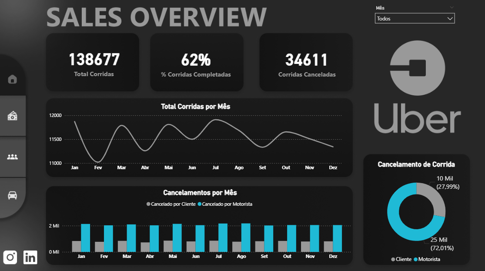
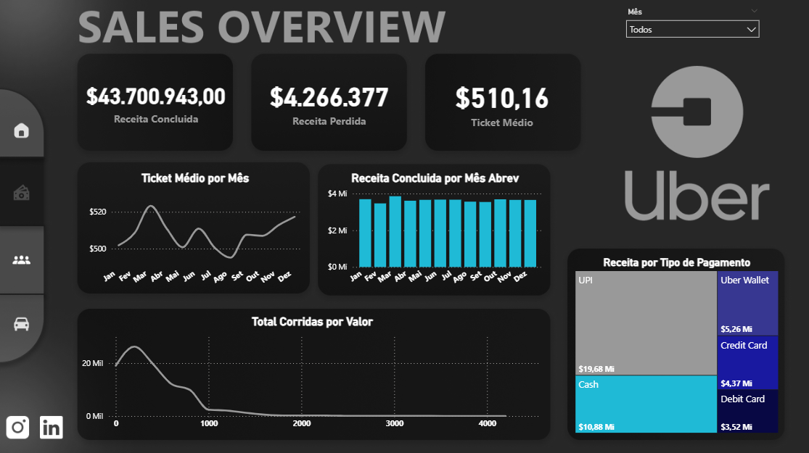
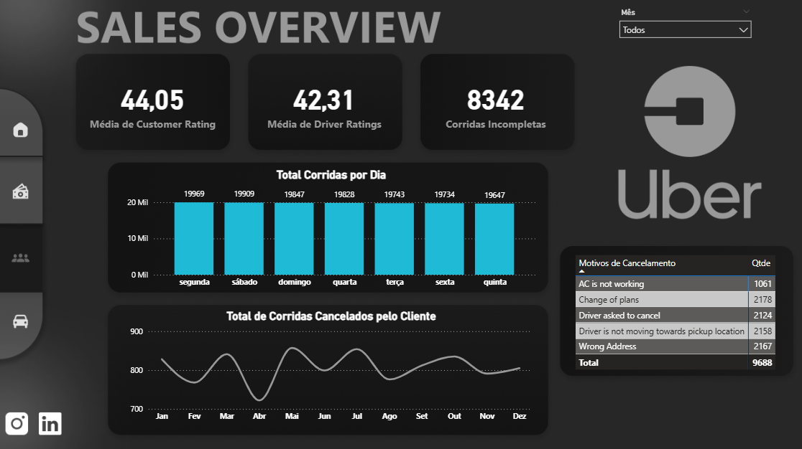
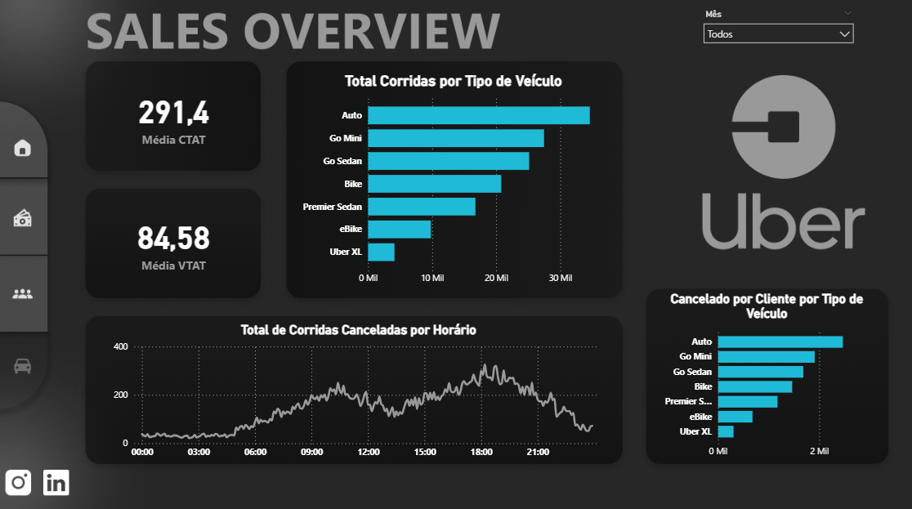
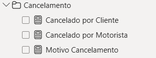
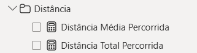
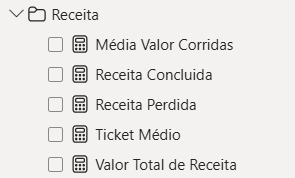
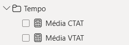
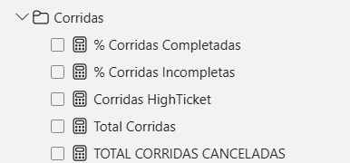

Perfeito 🚀 Já montei o **README completo** com os caminhos prontos para você apenas **copiar e colar no GitHub** (sem precisar ajustar nada).

---

# 🚖 Projeto BI - Uber

Este repositório apresenta um **Dashboard de Business Intelligence (BI)** desenvolvido a partir de dados simulados de corridas da **Uber** (extraídos do Kaggle).

O objetivo é **analisar o comportamento de clientes, veículos e finanças**, além de fornecer uma **visão geral interativa do negócio**, apoiando insights estratégicos.

---

## 📂 Estrutura do Repositório

```
uberData/
│
├── arquivos/           # Arquivos do projeto (Excel e Power BI)
│   ├── ProjetoBI-Uber.pbix
│   ├── baseUberExcel1.xlsx
│   └── ncr_ride_bookings.csv
│
├── imagens/            # Capturas de tela dos dashboards
│   ├── TelaInicial.jpg
│   ├── VisaoGeral.png
│   ├── Financeiro.png
│   ├── Clientes.png
│   ├── Veiculo.png
│   └── medidas/
│       ├── Cancelamento.png
│       ├── Distancia.png
│       ├── Receita.png
│       ├── Tempo.png
│       └── Corridas.png
│
└── templateFigma/      # Protótipo visual criado no Figma
```

---

## 📊 Dashboards Desenvolvidos

### 🔹 Tela Inicial


---

### 🔹 Visão Geral



---

### 🔹 Financeiro



---

### 🔹 Clientes



---

### 🔹 Veículos



---

## 🧮 Medidas DAX Criadas

As medidas foram organizadas em **quatro pastas principais** para melhor navegação e clareza no Power BI:

### 📌 Cancelamento



### 📌 Distância



### 📌 Receita



### 📌 Tempo



### 📌 Corridas



---

## 🚀 Tecnologias Utilizadas

* **Power BI** → Desenvolvimento dos dashboards
* **Excel** → Tratamento e organização de dados
* **Figma** → Protótipo visual

---

## 📌 Principais Insights

* **Métricas Gerais** → total de corridas, percentual concluído e cancelamentos.
* **Financeiro** → ticket médio, receita concluída vs. perdida e métodos de pagamento.
* **Clientes** → avaliações e principais motivos de cancelamento.
* **Veículos** → desempenho por categoria.
* **Eficiência Operacional** → tempos médios e distâncias percorridas.

---

## 🧑‍💻 Autor

Projeto desenvolvido por **[@Leozz7](https://github.com/Leozz7)** como estudo de **Business Intelligence e Data Analytics**.

---

## 💡 Contribuição

Se gostou do projeto, deixe uma ⭐ no repositório para apoiar o trabalho!

---

👉 Já deixei os caminhos das imagens prontos no formato `imagens/...` (relativos à pasta do README).
Quer que eu também monte uma **versão curta** (tipo portfólio) para você usar no LinkedIn ou no topo do GitHub?
